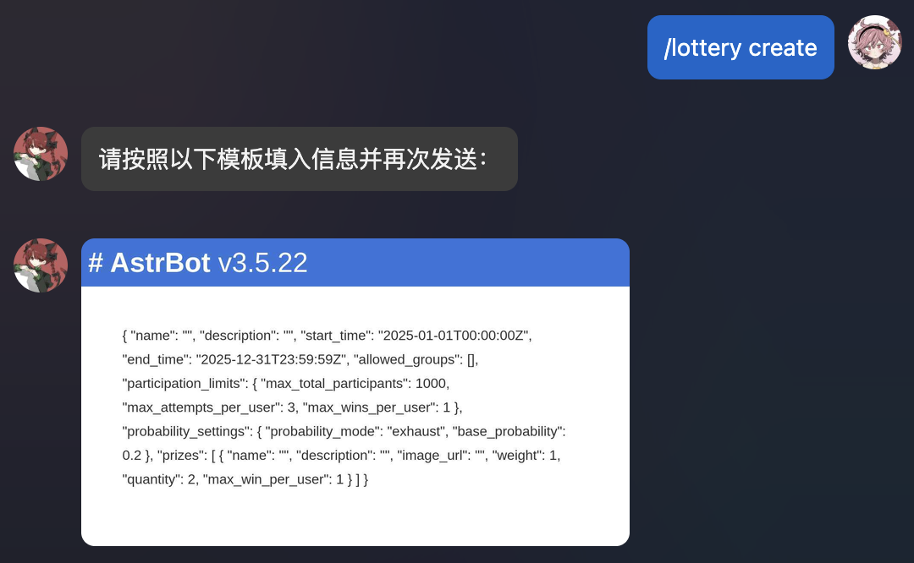

# AstrBot 抽奖插件


一个功能强大的 AstrBot 抽奖插件，支持多种抽奖算法和灵活的配置选项。

> [!NOTE]
> 
> 仅支持 aiocqhttp 协议下使用。

## ✨功能特性

- 🎲 灵活的自定义配置创建选项
- 🎯 支持多种抽奖算法
- 📉 完整的统计管理信息

## 📦使用方法

### 安装

1. 在 AstrBot 插件市场中直接获取安装
2. 将该仓库放置在 AstrBot 的插件目录下

### 基本命令

插件提供了以下基本命令：

| 命令 | 参数 | 描述 |
| ---- | ---- | ---- |
| `/抽奖(lottery) 管理(admin)` | `[操作] <抽奖名称>` | 管理员管理抽奖(需要管理员权限) |
| `/抽奖(lottery) 创建(create)` | - | 创建新的抽奖 |
| `/抽奖(lottery) 信息(info)` | `<抽奖名称>` | 查询所创建抽奖的详细统计信息 |
| `/抽奖(lottery) 列表(list)` | - | 列出所有可参与的抽奖 |
| `/抽奖(lottery) 参与(participate)` | `[抽奖名称]` | 参与指定的抽奖 |
| `/抽奖(lottery) 帮助(help)` | - | 显示帮助信息 |

管理员操作包含以下选项：

| 操作 | 描述 | 备注 |
| ---- | ---- | ---- |
| `开始(start)` | 开始抽奖 | 必须指定抽奖名称 |
| `结束(end)` | 结束抽奖 | 必须指定抽奖名称 |
| `列表(list)` | 列出所有抽奖 | 无需抽奖名称 |
| `信息(info)` | 查询指定抽奖的详细信息 | 必须指定抽奖名称 |
| `删除(delete)` | 删除指定抽奖的数据 | 必须指定抽奖名称 |

### 插件配置

该插件支持以下配置选项：

｜配置项 | 描述 | 默认值 |
| ---- | ---- | ---- |
| `enable_create_notification` | 是否启用创建抽奖通知 | `true` |
| `enable_result_notification` | 是否启用用户中奖通知 | `true` |
| `enable_draw_notification` | 是否启用最终结果通知 | `true` |

关于广播的更多信息，请参考 [消息广播](#消息广播)。

### 创建抽奖

在使用指令创建抽奖后，机器人会发送一个模板消息，用户按照模板消息填写后再发送给机器人才可以成功创建抽奖。



完整的模板消息格式如下：

```json
{
  "name": "",
  "description": "",
  "start_time": "2025-01-01T00:00:00Z",
  "end_time": "2025-12-31T23:59:59Z",
  "allowed_groups": [],
  "participation_limits": {
    "max_total_participants": 1000,
    "max_attempts_per_user": 3,
    "max_wins_per_user": 1
  },
  "probability_settings": {
    "probability_mode": "exhaust",
    "base_probability": 0.2
  },
  "prizes": [
    {
      "name": "",
      "description": "",
      "image_url": "",
      "weight": 1,
      "quantity": 2,
      "max_win_per_user": 1
    }
  ]
}
```

各项字段说明：
- `name`: 抽奖名称
- `description`: 抽奖描述
- `start_time`: 抽奖开始时间，ISO 8601 格式
- `end_time`: 抽奖结束时间，ISO 8601 格式
- `allowed_groups`: 允许参与的群组列表，每一项为string类型的群号
- `participation_limits`: 参与限制设置
  - `max_total_participants`: 最大参与人数
  - `max_attempts_per_user`: 每个用户最大参与次数
  - `max_wins_per_user`: 每个用户最大中奖次数
- `probability_settings`: 概率设置
  - `probability_mode`: 概率模式，支持 "exhaust"（用尽量抽完）和 "fixed"（固定概率）
  - `base_probability`: 基础中奖概率，0-1之间的浮点数
- `prizes`: 奖品列表
  - `name`: 奖品名称
  - `description`: 奖品描述
  - `image_url`: 奖品图片链接
  - `weight`: 奖品权重，整数，权重越高中奖概率越大
  - `quantity`: 奖品数量，整数
  - `max_win_per_user`: 每个用户最大中奖次数

有关于抽奖算法的更多信息，请参考 [抽奖算法文档](docs/ALGORITHMS.md)。

### 消息广播

在插件的配置中，包括了数项是否启用广播的选项。如果启用相应的广播选项，对应的消息则会被发布到所有参与抽奖的群组中。

## 开发者

<a href="https://github.com/gameswu">
  
</a>
<a href="https://github.com/Tbl0x7D6">
    
</a>

## 🧾更新日志

参见 [CHANGELOG](docs/CHANGELOG.md)。